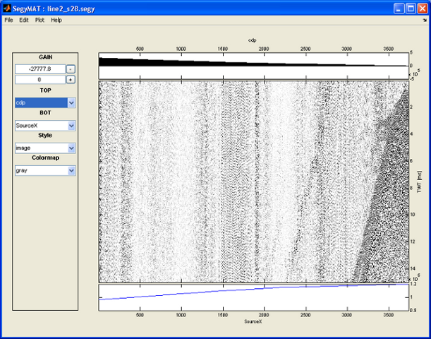
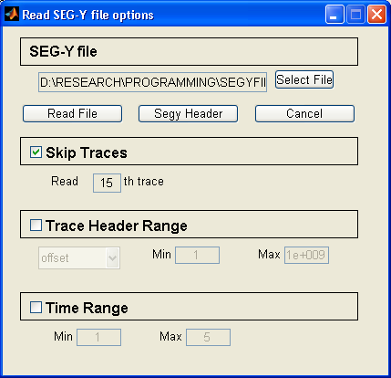
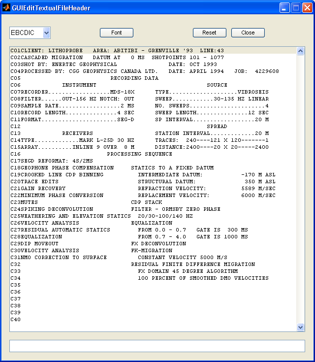

Misc
====

## Visualization
----------------

wiggle
~~~~~~

``wiggle.m`` is used to plot seismic data using using wiggle or variable
area type plotting, optionally on top of an image plot of the data

wiggle type:

::

    [Data,STH,SH]=ReadSegy('841_m.sgy','jump',10);
                          % get from 
                          % http://gdr.nrcan.gc.ca/seismtlitho/archive/le/stacks_fgp_e.php
    wiggle([STH.TraceNumber],SH.time,Data,'wiggle',700);

.. figure:: figures/wiggle.png
   :alt: Wiggle plot

   Wiggle plot

Variable area:

::

    [Data,STH,SH]=ReadSegy('841_m.sgy','jump',10,'minmax','TraceNumber',3500,4000,'trange',8,10);
    wiggle([STH.TraceNumber],SH.time,Data,'VA',700);

.. figure:: figures/wiggle_VA.png
   :alt: Wiggle plot

   Wiggle plot

Graphical User Interface utilities
----------------------------------

A simple graphical user interface has been implemented in Matlab (Note :
this section is unsupported in Octave).

SEGYMAT GUI
~~~~~~~~~~~

Calling ``segymat`` opens a graphical user interface for viewing and
editing SGY formatted files:

   Editing the SGY binary header - segymat GUI

Keyboard shortcuts:

+--------------------+--------------------------------------+
| Shortcut           | Action                               |
+====================+======================================+
| +                  | Increase gain                        |
+--------------------+--------------------------------------+
| -                  | Decrease gain                        |
+--------------------+--------------------------------------+
| 4                  | Pan left                             |
+--------------------+--------------------------------------+
| 6                  | Pan right                            |
+--------------------+--------------------------------------+
| 2                  | Pan down                             |
+--------------------+--------------------------------------+
| 8                  | Pan up                               |
+--------------------+--------------------------------------+
| 1                  | Pan down/left                        |
+--------------------+--------------------------------------+
| 3                  | Pan down/right                       |
+--------------------+--------------------------------------+
| 7                  | Pan up/left                          |
+--------------------+--------------------------------------+
| 9                  | Pan up/right                         |
+--------------------+--------------------------------------+
| 5                  | Center                               |
+--------------------+--------------------------------------+
| a / arrow left     | Zoom in                              |
+--------------------+--------------------------------------+
| z / arrow right3   | Zoom out                             |
+--------------------+--------------------------------------+
| h                  | toggle hiding plotting preferences   |
+--------------------+--------------------------------------+

simple reading SEG-Y files
^^^^^^^^^^^^^^^^^^^^^^^^^^

Select File->Open to select a SEG-Y file, which will be read using the
original SEG-Y header information.

expert reading SEG-Y files
^^^^^^^^^^^^^^^^^^^^^^^^^^

Select File->Open(expert) to handle SEG-Y header values prior to reading
the file, and to read in only part of the SEG-Y file.

   Editing the SGY binary header - segymat GUI

Editing the SGY header
^^^^^^^^^^^^^^^^^^^^^^

``GUIEditSegyHeader`` is a GUI for editing the SGY header.

::

    [Data,STH,SH]=ReadSegy('841_m.sgy');
    SH=GUIEditSegyHeader(SH);

.. figure:: figures/segymat_gui_segyheader.png
   :alt: Editing the SGY binary header - segymat GUI

   Editing the SGY binary header - segymat GUI

From this GUI it is possible to view and edit the Textual File Header
(`Editing the SGY header <#gui_edit_segyheader>`__)

Viewing the textual file header
^^^^^^^^^^^^^^^^^^^^^^^^^^^^^^^

``GUIEditTextualFileHeader`` is a GUI for viewing the textual file
header (either in ASCII of EBCDIC format) [editing is not yet
implemented].

::

    [Data,STH,SH]=ReadSegy('841_m.sgy');
    SH=GUIEditTextualFileHeader(SH);

   Editing the SGY binary header - segymat GUI

This GUI is integrated into ``GUIEditSegyHeader``\ (`Editing the SGY
header <#gui_edit_segyheader>`__).
